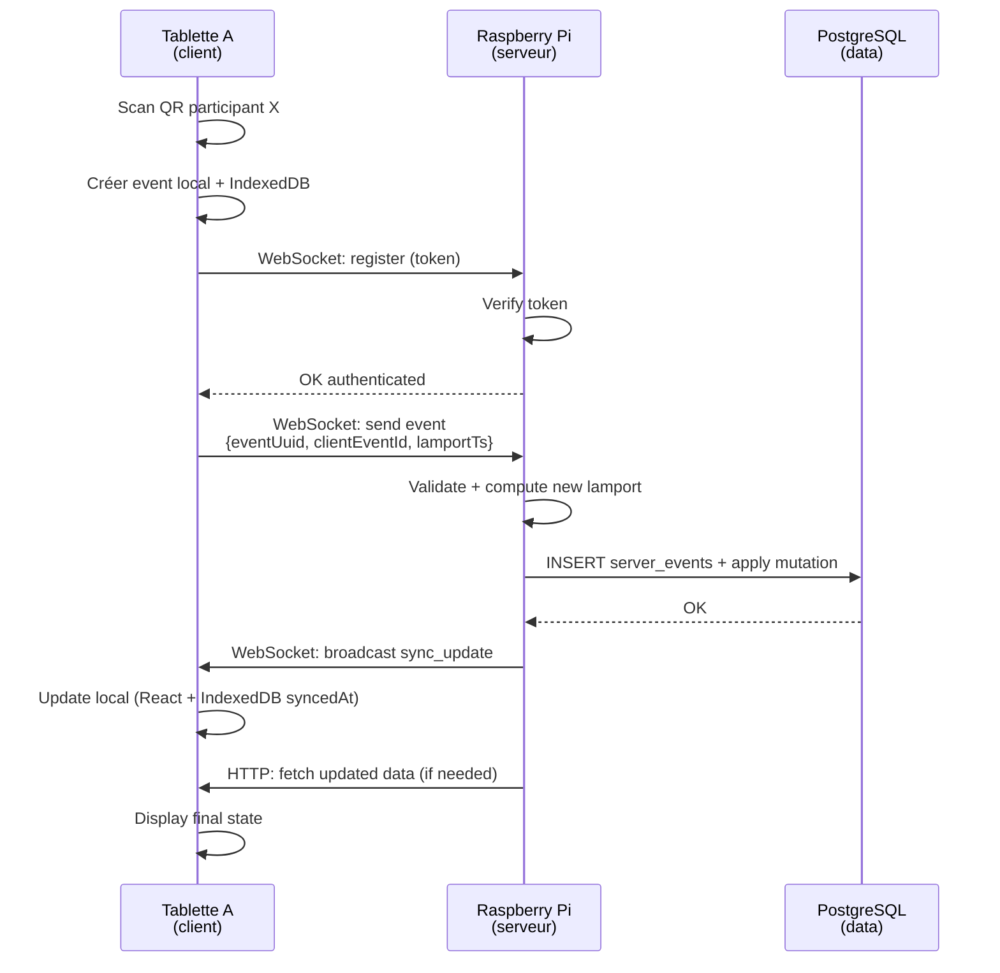
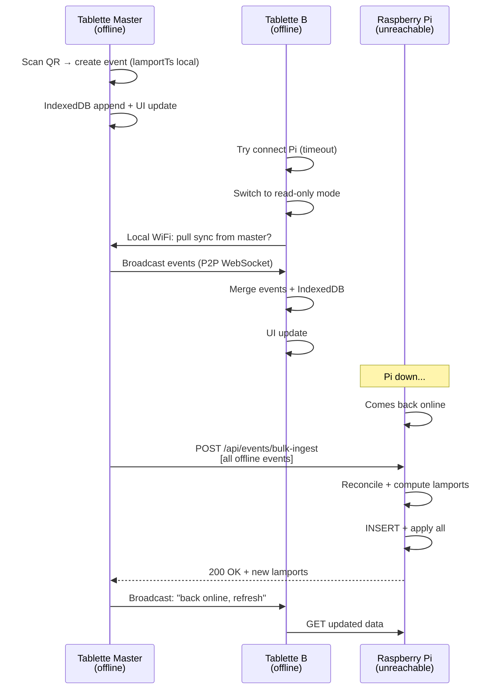

# Synchronisation des données : Le cœur du projet

Ce chapitre explique en détail **comment les tablettes et le serveur Raspberry Pi se synchronisent** en mode online/offline, via WebSocket et event-sourcing local-first.

## Principes fondamentaux

### Mode online vs offline

DarkEventManager implémente **3 états de connectivité** :

| État | `isOnlineMode` | Qui peut écrire | Qui peut lire |
|------|----------------|-----------------|--------------|
| **Online (normal)** | `true` | Toutes les tablettes | Toutes les tablettes |
| **Offline (master active)** | `false` | Seule la master device | Toutes les tablettes (cache) |
| **Offline (fallback)** | `false` | Aucune | Mode lecture seule (cache) |

**Basculement** :
- Automatique si Pi ne répond plus > 30s
- Manuel via interface admin (toggle `/api/sync/config`)

### Configuration sync

Stockée dans la table `app_config` (une ligne unique) :

```sql
app_config
├─ id: 1 (unique)
├─ isOnlineMode: BOOLEAN
├─ masterDeviceId: TEXT (UUID de la tablette maître)
├─ masterDeviceName: TEXT (e.g., "Tablette comptoir")
└─ updatedAt: TIMESTAMP
```

Chargée au démarrage et cachée en RAM (`storage.getSyncConfig()`).

## Contrôle d'accès : checkSyncPermissions

Middleware central appliqué sur toutes les mutations (POST, PUT, PATCH, DELETE) :

```typescript
// server/sync-middleware.ts
export async function checkSyncPermissions(req: Request, res: Response, next: NextFunction) {
  if (!['POST', 'PUT', 'PATCH', 'DELETE'].includes(req.method)) {
    return next();  // GET autorisé toujours
  }

  const config = await storage.getSyncConfig();

  if (config.isOnlineMode) {
    return next();  // Tous peuvent écrire
  }

  // Mode offline: vérifier X-Device-ID header
  const deviceId = req.headers['x-device-id'] as string;
  if (!deviceId || config.masterDeviceId !== deviceId) {
    return res.status(403).json({
      message: "Mode offline: seul appareil maître peut modifier",
      isMaster: false,
      masterDeviceName: config.masterDeviceName
    });
  }

  next();  // C'est la master device
}
```

**Client** : Fournir `X-Device-ID: <uuid>` sur toutes les requêtes (via interceptor `fetch`).

## WebSocket : Synchronisation temps réel

### Endpoint et authentification

```
WebSocket: ws://pi.local:5000/ws
```

**Authentification via HMAC token** (15min TTL) :

```
1. Client: GET /api/sync/ws-token
   → Response: { token: "eyJ...", expiresIn: 900 }

2. Client: WebSocket connect + register message:
   {
     "type": "register",
     "token": "eyJ...",
     "deviceId": "uuid-abc-123",
     "deviceName": "Tablette comptoir"
   }

3. Server: verifyDeviceToken(token)
   → Si valide: client authentifié
   → Sinon: disconnect
```

**Token signature** : HMAC-SHA256 avec `process.env.WEBSOCKET_SECRET`

### Message types

#### 1. Client → Server : Register

```json
{
  "type": "register",
  "token": "jwt_token",
  "deviceId": "device-uuid",
  "deviceName": "Tablette comptoir"
}
```

#### 2. Server → All Clients : Sync update

```json
{
  "type": "sync_update",
  "table": "purchases",
  "action": "created",
  "record": {
    "id": 123,
    "participantId": 42,
    "itemId": 7,
    "totalPrice": "5.00",
    "purchasedAt": "2024-06-20T14:32:10Z"
  }
}
```

#### 3. Server → All Clients : Config change

```json
{
  "type": "config_update",
  "config": {
    "isOnlineMode": false,
    "masterDeviceId": "device-uuid",
    "masterDeviceName": "Tablette comptoir"
  }
}
```

#### 4. Server ← All Clients : Event (sync proposal)

```json
{
  "type": "event",
  "event": {
    "eventUuid": "uuid-v4",
    "clientEventId": "client-uuid",
    "aggregateId": "42",
    "aggregateType": "participant",
    "eventType": "participant.assigned_to_squad",
    "payload": { "squadId": 5, "reason": "..." },
    "deviceId": "device-uuid",
    "lamportTs": 1234
  }
}
```

### Flow de sync typique

```
Tablette A (client)           WebSocket (server)           Pi (REST API)
│                             │                            │
├─ Maj local IndexedDB ──────>│                            │
│  (event-store)              │                            │
│                             │                            │
├─ Envoyer event ────────────>│ validate payload           │
│  (type: "event")            │ check lamport ts           │
│                             │ → POST /api/events/ingest  │
│                             │<─ 200 OK + server lamport  │
│                             │                            │
│                             ├─ Broadcast to all clients─>│
│                             │  (type: "sync_update")     │
│                             │                            │
│<─ Receive update ───────────┤                            │
│  Maj state local (React)    │                            │
│                             │                            │
```

## Event-sourcing local-first

### Architecture

Chaque appareil (tablette) maintient une **event-store locale** en IndexedDB (via Dexie) :

```typescript
// client/src/db/event-store.ts
interface AppEvent {
  eventUuid: string;           // UUID v4 unique pour cet événement
  clientEventId: string;       // UUID v4 de la mutation métier (achat, squad, etc.)
  aggregateId: string;         // Participant ID, Purchase ID, etc.
  aggregateType: "participant" | "purchase" | "meal_purchase" | "squad";
  eventType: string;           // "participant.assigned_to_squad", etc.
  payload: Record<string, unknown>;
  deviceId: string;            // UUID de la tablette
  lamportTs: number;           // Timestamp causal (Lamport)
  wallClockTs: number;         // Timestamp Unix (à titre informatif)
  createdAt: number;           // Timestamp création local
  syncedAt: number | null;     // Timestamp de sync server (null = non-synced)
  schemaVersion: number;       // Pour migrations futures
}
```

### Lamport timestamps

**Définition** : Entier incrémenté pour **garantir l'ordre causal** dans un système distribué sans horloge synchronisée.

**Règle d'incrémentation (serveur)** :

```
serverLamport = max(clientLamport, lastServerLamport) + 1
```

**Exemple** :
```
Client A: eventA.lamportTs = 10
Client B: eventB.lamportTs = 8
Serveur (lastLamport = 50):

Pour eventA: max(10, 50) + 1 = 51 ✓
Pour eventB: max(8, 50) + 1 = 51 (mais après A)

Order final au serveur:
1. eventA (lamport=51, processed first)
2. eventB (lamport=51, processed second, deviceId tiebreak)
```

**Avantage** : Même sans horloge synchronisée, l'ordre causal est **déterministe et reproductible**.

### Réconciliation offline

Quand la tablette maître revient online :

```
Client (offline-first)        Server (Pi)              Database
│                             │                        │
├─ POST /api/events/bulk-ingest ┤                      │
│  [event1, event2, ...]      │                        │
│                             ├─ Validate lamport ─────>│
│                             │ TRANSACTION:            │
│                             │  - compute new lamport  │
│                             │  - INSERT server_events │
│                             │  - Apply mutations      │
│                             │  - COMMIT or ROLLBACK   │
│                             │                        │
│                             │<─ 200 OK + new lamports │
│                             │                        │
│<─ Confirm synced ────────────┤                        │
│ Update local IndexedDB       │                        │
│ (syncedAt = now)             │                        │
│                             │                        │
```

### Résolution de conflits

**Default : Last-Write-Wins (LWW)** sur Lamport timestamp.

Exemple conflict :
```
Tablette A (offline): Modifie prix participant X = 10.00 (lamportTs=10)
Tablette B (online) : Modifie nom participant X = "Bob" (lamportTs=20)

Reconciliation:
- eventA: lamportTs → 51
- eventB: lamportTs → 52
- Final state: X = { name: "Bob", price: 10.00 } ✓ (coherent)
```

Cas vraiment conflictuel (même field, différentes valeurs) :
```
Tablette A (offline): Modifie prix item X = 5.00 (lamportTs=10)
Tablette B (online) : Modifie prix item X = 6.00 (lamportTs=20)

Reconciliation:
- eventA: lamportTs → 51 (appliquée AVANT)
- eventB: lamportTs → 52 (appliquée APRÈS)
- Final state: prix = 6.00 (B gagne car plus haute lamport)
- Justification: B a agi après voir l'état de A
```

Pour **override custom** (ex: majorité vote), implémenter logic spécifique par `eventType`.

## Idempotence via clientEventId

### Problème : Retry réseau duplique

```
Tablette A: POST /api/purchases { participantId: 42, amount: 15 }
Server: 201 Created { id: 123 }
Réseau: Response perdue

Tablette A (timeout): Retry POST /api/purchases { participantId: 42, amount: 15 }
Server: Reçoit ENCORE → Sans idempotence = 2 achats! ❌
```

### Solution : Index unique partiel sur clientEventId

```sql
-- shared/schema.ts
purchases = pgTable('purchases', {
  id: integer().primaryKey().generatedAlwaysAsIdentity(),
  participantId: integer().notNull(),
  shopItemId: integer().notNull(),
  quantity: integer().default(1),
  totalPrice: text().notNull(),
  clientEventId: text(),  // ← UUID v4 du client
  createdAt: timestamp().defaultNow(),
  // ...
}, (table) => ({
  uniqueClientEventId: uniqueIndex('uniq_purchases_client_event_id')
    .on(table.clientEventId)
    .where(sql`${table.clientEventId} IS NOT NULL`),
}));
```

**Insertion avec idempotence** :

```typescript
// server/storage.ts
async function createPurchase(input: {
  participantId: number,
  shopItemId: number,
  quantity: number,
  clientEventId?: string  // UUID v4 du client
}) {
  try {
    const [purchase] = await db
      .insert(purchases)
      .values({
        ...input,
        // Si clientEventId = "uuid-abc", insert l'ignore si déjà present
      })
      .onConflictDoNothing()
      .returning();
    
    return purchase;  // New or existing
  } catch (error) {
    // Handle error
  }
}
```

**Résultat** :
- 1er retry : insert réussit, enregistre `clientEventId`
- 2e retry : conflit UNIQUE → ignoré `ON CONFLICT DO NOTHING`
- Comptabilité exacte ✓

### Client-side génération

```typescript
// client/src/hooks/useIdempotentPurchase.ts
const clientEventId = crypto.randomUUID();  // v4
const response = await fetch('/api/purchases', {
  method: 'POST',
  body: JSON.stringify({
    participantId: 42,
    shopItemId: 7,
    quantity: 1,
    clientEventId  // ← Envoyé systématiquement
  })
});
```

**Cf. [ADR-005](./adr/0005-idempotence-achats-client-event-id.md)** pour justification complète.

## PWA et mode offline

### Service Worker avec Workbox

```typescript
// vite.config.ts
VitePWA({
  registerType: "autoUpdate",
  workbox: {
    navigateFallback: "/index.html",
    navigateFallbackDenylist: [/^\/api\//, /^\/ws/],  // API pas cached
    runtimeCaching: [
      {
        urlPattern: /^\/api\//,
        handler: "NetworkFirst",  // Try network first, fallback cache
        options: {
          networkTimeoutSeconds: 5,
          cacheName: "api-cache",
          expiration: { maxEntries: 100, maxAgeSeconds: 86400 }
        }
      },
      {
        urlPattern: /\.(?:png|jpg|jpeg|svg)$/,
        handler: "CacheFirst",  // Assets: cache first
        options: {
          cacheName: "image-cache",
          expiration: { maxEntries: 60, maxAgeSeconds: 2592000 }
        }
      }
    ]
  }
});
```

**Cache strategies** :

| Strategy | Quand | Behavior |
|----------|-------|----------|
| **NetworkFirst** | API calls | Essayer réseau (5s timeout), sinon cache |
| **CacheFirst** | Images, assets | Cache d'abord, réseau si miss |

### IndexedDB event-store

Quand réseau indisponible :

1. **Client capture l'événement** → IndexedDB
2. **UI update optimiste** (React state)
3. **Retry background** quand WiFi revient
4. **Sync bulk** via `/api/events/bulk-ingest`

## Schéma de flux complet (Mode online)



## Schéma de flux offline (Tablette master)



---

**Voir aussi** :
- [ADR-001](./adr/0001-topologie-raspberry-pi-cave-local.md) — Architecture centralisée
- [ADR-003](./adr/0003-event-sourcing-local-first-lamport.md) — Event-sourcing + Lamport
- [ADR-005](./adr/0005-idempotence-achats-client-event-id.md) — Idempotence
- [05-sauvegardes-restauration.md](./05-sauvegardes-restauration.md) — Backup avec events
